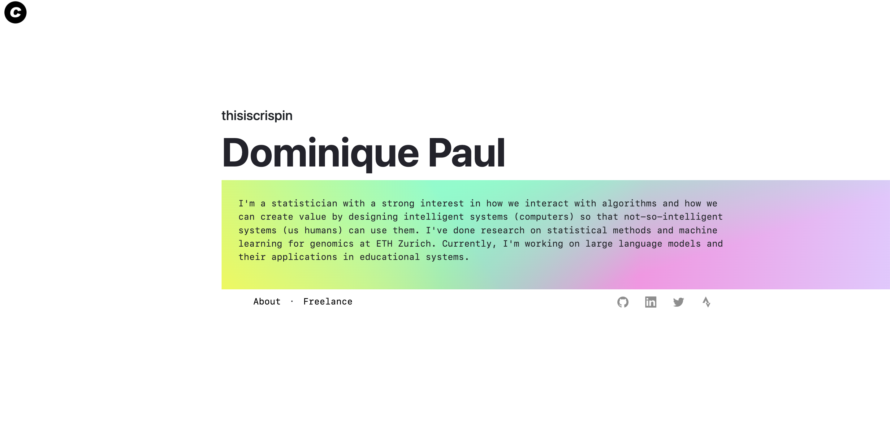

# thisiscrispin.com
### The code for my personal website

This is the code for my personal website [www.thisiscrispin.com](www.thisiscrispin.com). 

Some facts about the app:
- It's a client-only app based on react. 
- It's connected to GCP with CI/CD: Everytime the repository is updated a new container is deployed.
- Using an efficient docker image (have a look) I was able to reduce the docker image size by 78% to 171MB. The website is not called around the clock so cloud run will frequently launch a contianer for a website visit. A smaller docker image makes this much faster.

## Todos:

- [x] Added continuous deployment upon git push to google cloud run 
- [x] Add google analytics
- [ ] Change all css to tailwind (partially done)
- [ ] Add a section for blog posts
- [ ] Add a picture of myself

# Reminders for myself

### Running the code after downloading the repo in a new environment
1. [Optionally] Install node and npm via brew: `brew install node`
1. Install the packages in the folder: `npm install`

### Recreating the distribution code

`npm run build`